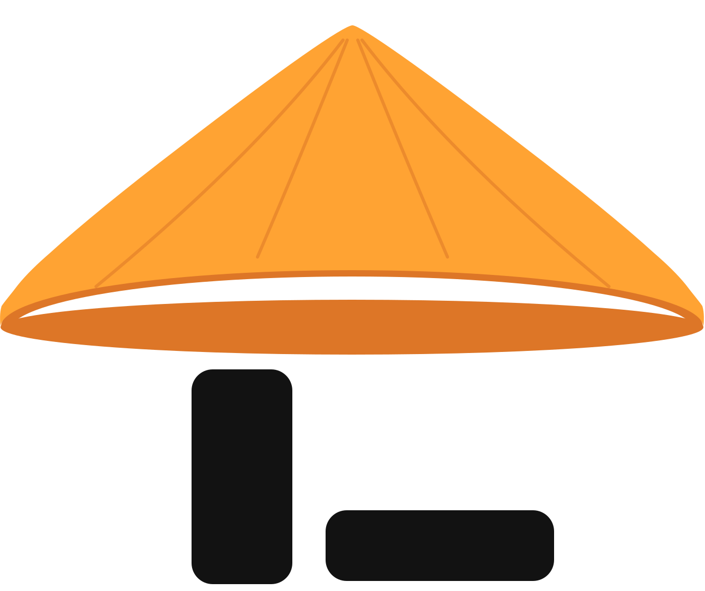

<p align="center">
  
</p>

<h1 align="center">Nonla Desk</h1>

<p align="center">
  <strong>Developer utilities desktop app for macOS</strong>
</p>

<p align="center">
  <a href="https://github.com/devnonla/nonla-desk/releases"></a>
  <a href="https://github.com/devnonla/nonla-desk/blob/main/LICENSE"></a>
</p>

---

## ✨ Features

- 🧩 **Mini App Platform** — Create, install, and manage mini apps with frontend (React/JSX), backend (Node.js), and panel support
- 🔧 **MCP Server** — Built-in Model Context Protocol server so AI editors (Cursor, Claude Desktop) can manage mini apps
- 🖥️ **Menu Bar App** — System tray with quick access panel for everyday developer utilities
- 💾 **Local SQLite** — Persistent storage for mini app data and configurations
- ⚡ **Built with Electron + React + TypeScript** for native macOS performance

## 📥 Install

### One-liner (recommended)

```bash
curl -fsSL https://raw.githubusercontent.com/devnonla/nonla-desk/main/scripts/install.sh | bash
```

### Manual download

1. Download the latest `.dmg` from [Releases](https://github.com/devnonla/nonla-desk/releases/latest)
2. Open the `.dmg` and drag **Nonla Desk** to `/Applications`
3. Remove the quarantine flag (app is unsigned):
   ```bash
   xattr -cr /Applications/Nonla\ Desk.app
   ```

> **Note:** The app is not code-signed. macOS Gatekeeper will block it on first launch unless you remove the quarantine attribute with the command above.

## 🚀 Development

### Prerequisites

- **macOS** 12.0 or later
- **Node.js** >= 18
- **Bun** >= 1.0

### Setup

```bash
# Clone the repository
git clone https://github.com/devnonla/nonla-desk.git
cd nonla-desk

# Install dependencies
bun install

# Start the app in development mode
bun dev
```

### Build

```bash
# Build production, install to /Applications, and launch (local test)
bun run local

# Build for production (macOS) — DMG + zip in dist/
bun run build:mac

# Build unpacked version for testing
bun run build:unpack
```

## 🏗️ Project Structure

```
nonla-desk/
├── src/
│   ├── main/          # Electron main process
│   ├── preload/       # Preload scripts (IPC bridge)
│   └── renderer/      # React frontend (renderer process)
├── resources/         # App icons and static assets
├── scripts/           # Build & release scripts
├── electron.vite.config.ts
└── package.json
```

## 🛠️ Tech Stack

| Layer       | Technology                        |
|-------------|-----------------------------------|
| Framework   | Electron 35                       |
| Frontend    | React 19, React Router 7         |
| Styling     | Tailwind CSS 4                   |
| Database    | better-sqlite3, Drizzle ORM      |
| Build       | electron-vite, Vite              |
| Lint/Format | Biome 2                          |
| Language    | TypeScript 5                     |

## 📝 Scripts

| Command                | Description                      |
|------------------------|----------------------------------|
| `bun dev`              | Start development server         |
| `bun run build`        | Build all processes              |
| `bun run build:mac`    | Build macOS distributable (.dmg) |
| `bun run build:unpack` | Build unpacked app for testing   |
| `bun run lint`         | Run linter                       |
| `bun run format`       | Format code                      |
| `bun run check`        | Lint + format (auto-fix)         |

## 📋 Changelog

### v0.1.0 — 2026-09-08

**Added**

- First public release of Nonla Desk for macOS
- Mini app platform: create, install, edit, enable/disable, and delete apps with React/JSX UI, Node.js backends, and tray panels
- Built-in MCP server so Cursor, Claude Code, and similar editors can manage mini apps
- Menu bar tray with a quick-access panel
- Local SQLite persistence for mini app data and settings
- Meadow desktop workspace with command palette and windowed tools

## 🤝 Contributing

Contributions are welcome! Please read the [Contributing Guide](CONTRIBUTING.md) before submitting a Pull Request.

## 📄 License

This project is licensed under the [MIT License](LICENSE).
